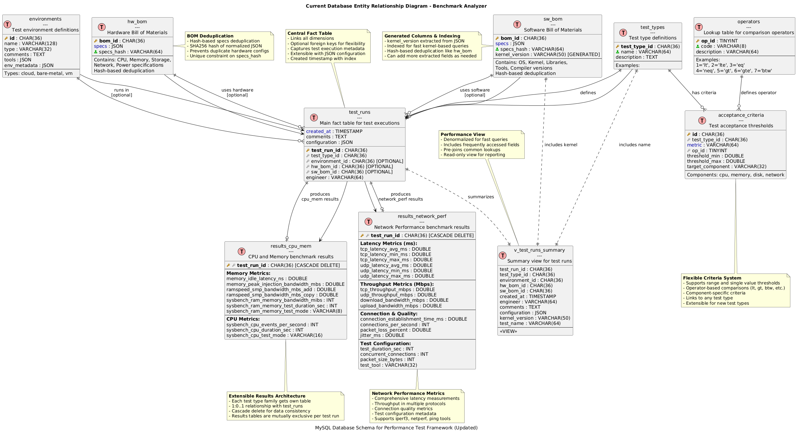

# Benchmark Analyzer Framework

A comprehensive framework for analyzing hardware and software benchmark results with automated parsing, validation, storage, and visualization capabilities.

---

## Table of Contents

- [Overview](#overview)
- [Features](#features)
- [Architecture](#architecture)
- [Quick Start](#quick-start)
- [Installation](#installation)
- [Usage](#usage)
- [Documentation](#documentation)
- [Test Development Guide](#test-development-guide)
- [API Documentation](#api-documentation)
- [Development](#development)
- [Configuration](#configuration)
- [Testing](#testing)
- [Contributing](#contributing)

---

## Overview

The Benchmark Analyzer Framework provides a complete solution for managing benchmark test results across different hardware and software configurations. It automatically parses test outputs, validates against schemas, stores in a database, and provides rich visualization and analysis capabilities.

**Key Use Cases:**
- Hardware performance validation and regression testing
- Software optimization tracking across releases
- A/B testing of system configurations
- Performance baseline establishment
- Automated CI/CD performance gates

---

## Features

### Core Features
- **Automated Parsing**: Support for JSON, CSV, and ZIP package formats
- **Schema Validation**: JSON Schema-based validation for data integrity
- **Database Storage**: MySQL backend with optimized schema design
- **REST API**: Full-featured API for programmatic access
- **Dashboard**: Interactive Grafana dashboards for visualization
- **Docker Support**: Complete containerized deployment
- **Environment Isolation**: Environment-based configuration management

### Test Type Support
- **CPU/Memory Tests**: Sysbench, RAMspeed, custom latency tests
- **Network Tests**: iperf3, bandwidth, latency measurements
- **Storage Tests**: fio, disk I/O performance
- **Custom Tests**: Extensible parser system for new test types

### Infrastructure
- **Database**: MySQL 8.0 with optimized performance schema
- **API Server**: FastAPI with async support and auto-documentation
- **Monitoring**: Grafana dashboards

---

## Architecture

```
┌─────────────────┐    ┌──────────────────┐    ┌─────────────────┐
│   Test Results  │    │   CLI/API        │    │   Storage       │
│                 │    │                  │    │                 │
│ • JSON Files    │───▶│ • Parser System  │───▶│ • MySQL DB      │
│ • CSV Data      │    │ • Validation     │    │ • File Storage  │
│ • ZIP Packages  │    │ • Data Loading   │    │ • Artifacts     │
└─────────────────┘    └──────────────────┘    └─────────────────┘
                                │
                                ▼
┌─────────────────┐    ┌──────────────────┐    ┌─────────────────┐
│   Visualization │    │   API Services   │    │   Monitoring    │
│                 │    │                  │    │                 │
│                 │◀───│ • REST API       │───▶│ • Grafana       │
│ • Grafana       │    │ • Authentication │    │ • Prometheus    │
│ • Custom Charts │    │ • File Upload    │    │ • Health Checks │
└─────────────────┘    └──────────────────┘    └─────────────────┘
```

### Component Overview

| Component | Technology | Purpose |
|-----------|------------|---------|
| **CLI** | Typer + Rich | Command-line interface for operations |
| **API** | FastAPI | REST API for programmatic access |
| **Database** | MySQL 8.0 | Structured storage for test results |
| **Parser System** | Custom Python | Extensible parsing for different formats |
| **Validation** | JSON Schema | Data integrity and schema validation |
| **Dashboard** | Grafana | Interactive data visualization |
| **Infrastructure** | Docker Compose | Containerized deployment |

---

## Quick Start

### Prerequisites
- Python 3.12+ with [uv](https://github.com/astral-sh/uv) package manager
- Docker and Docker Compose
- Git

### 1. Clone and Setup

```bash
# Clone repository
git clone <repository-url>
cd benchmark-analyzer

# Install uv package manager
make install-uv

# Set up development environment
make setup

# Copy environment configuration
cp .env.example .env
# Edit .env with your database credentials and settings
```

### 2. Start Infrastructure

```bash
# Start all infrastructure services (MySQL, Grafana, API)
make dev

# Or start services individually
make infra-up    # Start MySQL and Grafana
make api-dev     # Start API in development mode
```

### 3. Import Sample Data

```bash
# Load sample CPU/Memory test data
make sample-data

# Or import specific test data
benchmark-analyzer import-results \
  --package examples/sample_cpu_mem.zip \
  --type cpu_mem \
  --engineer "Your Name" \
  --comments "Initial test data"
```

### 4. Access Services

- **API Documentation**: http://localhost:8000/docs
- **Grafana Dashboard**: http://localhost:3000 (admin/admin123)

---

## Usage

### CLI Usage

#### Database Management
```bash
# Initialize database
benchmark-analyzer db init

# Check database status
benchmark-analyzer db status

# Clean all data (warning: destructive!)
benchmark-analyzer db clean --force

# Create backup
benchmark-analyzer db backup backups/backup_$(date +%Y%m%d).sql
```

#### Importing Results

```bash
# Import test results (updated command)
benchmark-analyzer import-results \
  --package test_results_20240115.zip \
  --type cpu_mem \
  --engineer "John Doe" \
  --comments "Production baseline test"

# Import with environment file (optional)
benchmark-analyzer import-results \
  --package test_results.zip \
  --type cpu_mem \
  --environment environments/production.yaml \
  --engineer "John Doe"

# Validate only (don't import)
benchmark-analyzer import-results \
  --package test_results.zip \
  --type cpu_mem \
  --validate-only
```

#### Querying Data

```bash
# List recent test runs
benchmark-analyzer query test-runs --limit 10

# Filter by test type
benchmark-analyzer query test-runs --type cpu_mem

# Filter by engineer
benchmark-analyzer query test-runs --engineer "John Doe"

# List available test types
benchmark-analyzer query test-types
```

#### Configuration and Utilities

```bash
# Show current configuration
benchmark-analyzer config-info

# Validate schema against data
benchmark-analyzer schema validate \
  --schema contracts/tests/cpu_mem/schema.json \
  --data test_data.json

# Launch interactive dashboard
benchmark-analyzer dashboard
```

### API Usage

#### Health Check
```bash
curl http://localhost:8000/health
```

#### List Test Runs
```bash
curl "http://localhost:8000/api/v1/test-runs?limit=10&test_type=cpu_mem"
```

#### Get Test Run Details
```bash
curl http://localhost:8000/api/v1/test-runs/{test_run_id}
```

#### Upload Test Results
```bash
curl -X POST "http://localhost:8000/api/v1/test-runs/upload" \
  -F "test_package=@test_results.zip" \
  -F "test_type=cpu_mem" \
  -F "engineer=John Doe"
```

---

## Documentation

Comprehensive documentation is available to help you understand and extend the Benchmark Analyzer Framework.

### Architecture & Design
- **[CLI & API Architecture](docs/CLI_API_ARCHITECTURE.md)** - Complete overview of how the CLI interacts with the API for test results processing, including ZIP file handling and current vs alternative approaches
- **[Database Design](docs/database_design.md)** - Database schema, relationships, and design decisions
- **[Data Flow Workflow](docs/WORKFLOW.md)** - Detailed step-by-step data loading and processing workflow

### Developer Guides
- **[Adding New Test Types](docs/guides/ADDING_NEW_TEST_TYPE.md)** - Complete step-by-step guide for implementing new test types from scratch
- **[Network Performance Implementation](docs/guides/NETWORK_PERF_IMPLEMENTATION.md)** - Real-world case study showing complete test type implementation

### Visual Documentation
- **[Component Diagrams](docs/components.puml)** - PlantUML diagrams showing system components
- **[Database Relationships](docs/bom_relationships.puml)** - Entity relationship diagrams
- **[Sequence Diagrams](docs/benchmark_analyzer_sequence.puml)** - Process flow diagrams




### Quick Navigation

**New to the project?**
1. Start with [CLI & API Architecture](docs/CLI_API_ARCHITECTURE.md)
2. Read [Data Flow Workflow](docs/WORKFLOW.md)
3. Try [Adding New Test Types](docs/guides/ADDING_NEW_TEST_TYPE.md)

**Need to implement something?**
- Adding a test type → [Adding New Test Types](docs/guides/ADDING_NEW_TEST_TYPE.md)
- Understanding data flow → [Data Flow Workflow](docs/WORKFLOW.md)
- Troubleshooting uploads → [CLI & API Architecture](docs/CLI_API_ARCHITECTURE.md)

**For complete documentation index:** → [Documentation Directory](docs/README.md)

---

## Test Development Guide

### Overview

The framework uses a structured approach for defining, validating, and processing different types of benchmark tests. Each test type consists of:

1. **JSON Schema**: Defines the expected data structure and validation rules
2. **Parser Class**: Handles parsing of test result files
3. **Database Model**: Stores structured results (optional, for complex types)
4. **Validation Rules**: Ensures data integrity and completeness

> **For detailed implementation guides, see:**
> - **[Complete Test Type Implementation Guide](docs/guides/ADDING_NEW_TEST_TYPE.md)** - Step-by-step instructions with code examples
> - **[Network Performance Case Study](docs/guides/NETWORK_PERF_IMPLEMENTATION.md)** - Real implementation example
> - **[Data Flow Workflow](docs/WORKFLOW.md)** - Understanding the complete data processing pipeline

### Creating a New Test Type

#### Step 1: Define the JSON Schema

Create a schema file at `benchmark_analyzer/contracts/tests/{test_type}/schema.json`:

```json
{
  "$schema": "http://json-schema.org/draft-07/schema#",
  "type": "object",
  "title": "Network Latency Test Results Schema",
  "description": "Schema for validating network latency test results",
  "properties": {
    "test_name": {
      "type": "string",
      "description": "Name of the test run",
      "minLength": 1,
      "maxLength": 255
    },
    "timestamp": {
      "type": "string",
      "format": "date-time",
      "description": "ISO 8601 timestamp of test execution"
    },
    "target_host": {
      "type": "string",
      "description": "Target host for latency test",
      "format": "hostname"
    },
    "latency_stats": {
      "type": "object",
      "properties": {
        "min_ms": {"type": "number", "minimum": 0},
        "max_ms": {"type": "number", "minimum": 0},
        "avg_ms": {"type": "number", "minimum": 0},
        "stddev_ms": {"type": "number", "minimum": 0}
      },
      "required": ["min_ms", "max_ms", "avg_ms"]
    },
    "packet_loss_percent": {
      "type": "number",
      "minimum": 0,
      "maximum": 100
    }
  },
  "required": ["test_name", "timestamp", "target_host", "latency_stats"],
  "additionalProperties": true
}
```

#### Step 2: Create the Parser Class

Create a parser in `benchmark_analyzer/core/parser.py` or a separate module:

```python
from benchmark_analyzer.core.parser import BaseParser, ParserRegistry
import json
import csv
from pathlib import Path
from typing import Dict, Any, List

class NetworkLatencyParser(BaseParser):
    """Parser for network latency test results."""
    
    def get_test_type(self) -> str:
        """Get the test type identifier."""
        return "network_latency"
    
    def get_supported_extensions(self) -> List[str]:
        """Get list of supported file extensions."""
        return ['.json', '.csv', '.txt']
    
    def parse_file(self, file_path: Path) -> Dict[str, Any]:
        """Parse a single test result file."""
        try:
            if file_path.suffix.lower() == '.json':
                return self._parse_json_file(file_path)
            elif file_path.suffix.lower() == '.csv':
                return self._parse_csv_file(file_path)
            elif file_path.suffix.lower() == '.txt':
                return self._parse_ping_output(file_path)
            else:
                raise ParseError(f"Unsupported file format: {file_path.suffix}")
        except Exception as e:
            raise ParseError(f"Failed to parse {file_path}: {e}")
    
    def _parse_json_file(self, file_path: Path) -> Dict[str, Any]:
        """Parse JSON format test results."""
        with open(file_path, 'r') as f:
            data = json.load(f)
        return self.normalize_result(data)
    
    def _parse_csv_file(self, file_path: Path) -> Dict[str, Any]:
        """Parse CSV format test results."""
        with open(file_path, 'r') as f:
            reader = csv.DictReader(f)
            rows = list(reader)
        
        # Convert first row or aggregate multiple rows
        if len(rows) == 1:
            return self.normalize_result(self._convert_types(rows[0]))
        else:
            # Aggregate multiple measurements
            return self._aggregate_measurements(rows)
    
    def _parse_ping_output(self, file_path: Path) -> Dict[str, Any]:
        """Parse ping command output."""
        with open(file_path, 'r') as f:
            content = f.read()
        
        # Extract statistics using regex
        import re
        
        # Example ping output parsing
        stats_pattern = r'min/avg/max/stddev = ([\d.]+)/([\d.]+)/([\d.]+)/([\d.]+) ms'
        loss_pattern = r'(\d+)% packet loss'
        
        stats_match = re.search(stats_pattern, content)
        loss_match = re.search(loss_pattern, content)
        
        if not stats_match:
            raise ParseError("Could not extract latency statistics from ping output")
        
        result = {
            "test_name": file_path.stem,
            "timestamp": datetime.now().isoformat(),
            "target_host": self._extract_target_host(content),
            "latency_stats": {
                "min_ms": float(stats_match.group(1)),
                "avg_ms": float(stats_match.group(2)),
                "max_ms": float(stats_match.group(3)),
                "stddev_ms": float(stats_match.group(4))
            },
            "packet_loss_percent": float(loss_match.group(1)) if loss_match else 0.0
        }
        
        return self.normalize_result(result)
    
    def normalize_result(self, result: Dict[str, Any]) -> Dict[str, Any]:
        """Normalize result to standard format."""
        # Add timestamp if missing
        if 'timestamp' not in result:
            from datetime import datetime
            result['timestamp'] = datetime.now().isoformat()
        
        # Ensure required structure
        if 'latency_stats' not in result:
            result['latency_stats'] = {}
        
        return result
    
    def validate_result_structure(self, result: Dict[str, Any]) -> bool:
        """Validate the basic structure of parsed result."""
        required_fields = ['test_name', 'target_host', 'latency_stats']
        return all(field in result for field in required_fields)

# Register the parser
ParserRegistry.register("network_latency", NetworkLatencyParser)
```

#### Step 3: Create Database Model (Optional)

For complex test types that need specific database tables, add a model in `benchmark_analyzer/db/models.py`:

```python
class ResultsNetworkLatency(Base):
    """Results for Network Latency tests."""
    
    __tablename__ = "results_network_latency"
    
    test_run_id: Mapped[str] = mapped_column(
        MYSQL_CHAR(36),
        ForeignKey("test_runs.test_run_id", ondelete="CASCADE"),
        primary_key=True,
    )
    
    # Target and configuration
    target_host: Mapped[Optional[str]] = mapped_column(VARCHAR(255), nullable=True)
    test_duration_sec: Mapped[Optional[int]] = mapped_column(Integer, nullable=True)
    packet_count: Mapped[Optional[int]] = mapped_column(Integer, nullable=True)
    
    # Latency statistics
    min_latency_ms: Mapped[Optional[float]] = mapped_column(DOUBLE, nullable=True)
    max_latency_ms: Mapped[Optional[float]] = mapped_column(DOUBLE, nullable=True)
    avg_latency_ms: Mapped[Optional[float]] = mapped_column(DOUBLE, nullable=True)
    stddev_latency_ms: Mapped[Optional[float]] = mapped_column(DOUBLE, nullable=True)
    
    # Additional metrics
    packet_loss_percent: Mapped[Optional[float]] = mapped_column(DOUBLE, nullable=True)
    jitter_ms: Mapped[Optional[float]] = mapped_column(DOUBLE, nullable=True)
    
    # Relationships
    test_run = relationship("TestRun", back_populates="results_network_latency")

# Update MODEL_REGISTRY
MODEL_REGISTRY["results_network_latency"] = ResultsNetworkLatency
```

#### Step 4: Update Data Loader

Add support for the new test type in `benchmark_analyzer/core/loader.py`:

```python
def _load_test_results(
    self,
    session: Session,
    test_run: TestRun,
    test_type: str,
    results: List[Dict[str, Any]],
) -> None:
    """Load test results into appropriate table."""
    try:
        if test_type == "cpu_mem":
            self._load_cpu_mem_results(session, test_run, results)
        elif test_type == "network_latency":
            self._load_network_latency_results(session, test_run, results)
        else:
            logger.warning(f"No specific loader for test type {test_type}, skipping results")
    except Exception as e:
        logger.error(f"Failed to load test results for {test_type}: {e}")
        raise

def _load_network_latency_results(
    self,
    session: Session,
    test_run: TestRun,
    results: List[Dict[str, Any]],
) -> None:
    """Load Network Latency results."""
    try:
        # Aggregate results if multiple
        aggregated_result = self._aggregate_network_latency_results(results)
        
        latency_result = ResultsNetworkLatency(
            test_run_id=test_run.test_run_id,
            target_host=aggregated_result.get('target_host'),
            min_latency_ms=aggregated_result.get('latency_stats', {}).get('min_ms'),
            max_latency_ms=aggregated_result.get('latency_stats', {}).get('max_ms'),
            avg_latency_ms=aggregated_result.get('latency_stats', {}).get('avg_ms'),
            stddev_latency_ms=aggregated_result.get('latency_stats', {}).get('stddev_ms'),
            packet_loss_percent=aggregated_result.get('packet_loss_percent'),
        )
        
        session.add(latency_result)
        logger.debug(f"Added Network Latency results for test run {test_run.test_run_id}")
        
    except Exception as e:
        logger.error(f"Failed to load Network Latency results: {e}")
        raise
```

#### Step 5: Create BOM Schema (Optional)

If your test type requires specific hardware/software configurations, create a BOM schema:

```json
{
  "$schema": "http://json-schema.org/draft-07/schema#",
  "type": "object",
  "title": "Network Latency Test BOM Schema",
  "properties": {
    "hardware": {
      "type": "object",
      "properties": {
        "specs": {
          "type": "object",
          "properties": {
            "network_interface": {"type": "string"},
            "network_speed_gbps": {"type": "number"},
            "network_driver": {"type": "string"}
          }
        }
      }
    },
    "software": {
      "type": "object",
      "properties": {
        "specs": {
          "type": "object",
          "properties": {
            "ping_version": {"type": "string"},
            "os_network_stack": {"type": "string"}
          }
        }
      }
    }
  }
}
```

### Schema Validation Process

The framework automatically validates test results using a multi-layered approach:

1. **JSON Schema Validation**: Structure and data type validation
2. **Business Rule Validation**: Custom validation logic in parsers
3. **Database Constraint Validation**: Foreign key and constraint validation
4. **Cross-Reference Validation**: Consistency checks across related data

### Testing Your New Test Type

```bash
# 1. Validate your schema
benchmark-analyzer schema validate \
  --schema contracts/tests/network_latency/schema.json \
  --data sample_data.json

# 2. Test parsing
benchmark-analyzer import-results \
  --package network_test_results.zip \
  --type network_latency \
  --validate-only

# 3. Import test data
benchmark-analyzer import-results \
  --package network_test_results.zip \
  --type network_latency \
  --engineer "Test Engineer" \
  --comments "Testing new parser"

# 4. Verify data was stored correctly
benchmark-analyzer query test-runs --type network_latency
```

### Best Practices

1. **Schema Design**:
   - Include comprehensive field descriptions
   - Use appropriate data types and constraints
   - Add examples in the schema
   - Version your schemas for backwards compatibility

2. **Parser Implementation**:
   - Handle multiple input formats when possible
   - Implement robust error handling
   - Add comprehensive logging
   - Normalize data to consistent units

3. **Validation**:
   - Test with real-world data samples
   - Include edge cases in validation
   - Validate both success and failure scenarios

4. **Performance**:
   - Consider data aggregation strategies
   - Index important query fields in database models
   - Implement efficient bulk loading for large datasets

---

## API Documentation

### REST API Endpoints

#### Health and Status
- `GET /health` - API health check
- `GET /api/v1/status` - Detailed system status

#### Test Runs
- `GET /api/v1/test-runs` - List test runs with filtering
- `GET /api/v1/test-runs/{id}` - Get specific test run
- `POST /api/v1/test-runs/upload` - Upload test results
- `DELETE /api/v1/test-runs/{id}` - Delete test run

#### Test Types
- `GET /api/v1/test-types` - List available test types
- `GET /api/v1/test-types/{id}` - Get test type details
- `POST /api/v1/test-types` - Create new test type
- `PUT /api/v1/test-types/{id}` - Update test type

#### Environments
- `GET /api/v1/environments` - List environments
- `POST /api/v1/environments` - Create environment
- `PUT /api/v1/environments/{id}` - Update environment

#### File Upload
- `POST /api/v1/upload` - Generic file upload endpoint

### API Response Format

**Success Response:**
```json
{
  "data": {...},
  "message": "Success",
  "status_code": 200,
  "timestamp": "2024-01-15T14:30:00Z"
}
```

**Error Response:**
```json
{
  "error": "Validation failed",
  "message": "Invalid test data format",
  "details": ["Field 'test_name' is required"],
  "status_code": 400,
  "timestamp": "2024-01-15T14:30:00Z"
}
```

---

## Development

### Development Setup

```bash
# 1. Clone and set up environment
git clone <repository-url>
cd benchmark-analyzer
make setup

# 2. Start development environment
make dev

# 3. Run quality checks
make qa    # Format, lint, type check, and test

# 4. Start API in development mode
make api-dev
```

### Available Make Commands

**Environment Setup:**
```bash
make setup           # Set up development environment
make install         # Install dependencies
make update          # Update dependencies
make clean           # Clean build artifacts
```

**Code Quality:**
```bash
make format          # Format code with ruff
make lint            # Lint code
make lint-fix        # Fix auto-fixable lint issues
make typecheck       # Run type checking with mypy
make check           # Run all quality checks
make qa              # Full quality assurance pipeline
```

**Testing:**
```bash
make test            # Run all tests
make test-verbose    # Run tests with verbose output
make test-coverage   # Run tests with coverage
make test-unit       # Run unit tests only
make test-integration # Run integration tests only
make test-watch      # Run tests in watch mode
```

**Infrastructure:**
```bash
make infra-up        # Start infrastructure services
make infra-down      # Stop infrastructure services
make infra-logs      # Show infrastructure logs
make dev             # Start full development environment
make dev-stop        # Stop development environment
make dev-reset       # Reset development environment
```

**Database:**
```bash
make db-init         # Initialize database
make db-status       # Show database status
make db-clean        # Clean database (warning: destructive!)
make db-backup       # Create database backup
```

**Application:**
```bash
make api             # Run API server
make api-dev         # Run API server in development mode
make cli             # Show CLI help
```

**Build and Release:**
```bash
make build           # Build package
make publish-test    # Publish to test PyPI
make publish         # Publish to PyPI
```

### Project Structure

```
benchmark-analyzer/
├── benchmark_analyzer/          # Main package
│   ├── __init__.py
│   ├── config.py               # Configuration management
│   ├── cli/                    # Command-line interface
│   │   └── main.py
│   ├── core/                   # Core functionality
│   │   ├── parser.py           # Parser system
│   │   ├── validator.py        # Schema validation
│   │   └── loader.py           # Data loading
│   ├── db/                     # Database layer
│   │   ├── models.py           # SQLAlchemy models
│   │   └── connector.py        # Database connection
│   ├── contracts/              # Schemas and contracts
│   │   ├── environment_schema.json
│   │   └── tests/              # Test type schemas
│   │       ├── cpu_mem/
│   │       ├── network_latency/
│   │       └── ...
│   └── dashboards/             # Dashboard implementations
├── api/                        # REST API
│   ├── main.py                 # FastAPI application
│   ├── endpoints/              # API endpoints
│   ├── models/                 # Pydantic models
│   └── services/               # Business logic
├── infrastructure/             # Deployment
│   ├── docker-compose.yml      # Service definitions
│   ├── Dockerfile.api          # API container
│   └── grafana/                # Grafana configuration
├── tests/                      # Test suite
│   ├── unit/
│   ├── integration/
│   └── fixtures/
├── examples/                   # Example data and configs
├── docs/                       # Documentation
├── .env.example               # Environment template
├── pyproject.toml             # Project configuration
├── Makefile                   # Development commands
└── README.md                  # This file
```

---

## Configuration

### Environment Variables

The framework uses environment variables loaded from `.env` files for all configuration. This replaces the previous YAML-based configuration approach.

```bash
# Copy the example environment file
cp .env.example .env

# Edit configuration values
nano .env
```

#### Database Configuration
```bash
DB_HOST=localhost
DB_PORT=3306
DB_USER=benchmark
DB_PASSWORD=benchmark123
DB_NAME=perf_framework
DB_DRIVER=pymysql
```

#### API Configuration
```bash
API_HOST=0.0.0.0
API_PORT=8000
API_DEBUG=false
API_RELOAD=false
API_WORKERS=1
API_LOG_LEVEL=info
```

#### Security Configuration
```bash
SECRET_KEY=your-very-secret-key-change-in-production
ENABLE_AUTH=false
CORS_ORIGINS=*
MAX_FILE_SIZE=104857600
```

#### Path Configuration
```bash
BASE_DIR=/app
CONTRACTS_DIR=contracts
TEST_TYPES_DIR=contracts/tests
ENVIRONMENTS_DIR=contracts/environments
ARTIFACTS_DIR=artifacts
TEMP_DIR=temp
UPLOAD_DIR=uploads
LOGS_DIR=logs
```

#### Logging Configuration
```bash
LOG_LEVEL=INFO
LOG_FORMAT=%(asctime)s - %(name)s - %(levelname)s - %(message)s
LOG_FILE_PATH=logs/benchmark-analyzer.log
ENABLE_FILE_LOGGING=true
```

### Environment Files

#### Environment Contracts (YAML)
Environment files define the test execution context:

```yaml
# environments/production.yaml
name: "production"
type: "production"
tools:
  python: "3.11.7"
  sysbench: "1.0.20"
  gcc: "11.4.0"
metadata:
  location: "datacenter-1"
  hardware:
    cpu_model: "Intel Xeon Gold 6230R"
    memory_total: "128GB"
    network_interface: "10GbE"
  software:
    os: "Ubuntu 22.04.3 LTS"
    kernel: "5.15.0-88-generic"
```

#### BOM (Bill of Materials) Files
BOM files specify exact hardware/software configurations:

```yaml
# boms/server_config.yaml
hardware:
  specs:
    cpu:
      model: "Intel Xeon Gold 6230R"
      cores: 26
      threads: 52
      base_frequency: "2.10GHz"
    memory:
      total: "128GB"
      type: "DDR4-3200"
      modules: 8
    storage:
      type: "NVMe SSD"
      capacity: "2TB"
      model: "Samsung 980 PRO"

software:
  specs:
    os:
      name: "Ubuntu"
      version: "22.04.3 LTS"
      kernel: "5.15.0-88-generic"
    compilers:
      gcc: "11.4.0"
      python: "3.11.7"
    benchmarks:
      sysbench: "1.0.20"
      fio: "3.28"
```

---

## Testing
TBD

---

## Changelog

### [0.1.0] - 2024-01-15

#### Added
- **Core Framework**: Complete benchmark analysis framework
- **CLI Interface**: Comprehensive command-line tool with Typer and Rich
- **REST API**: FastAPI-based API with auto-documentation
- **Database Schema**: Optimized MySQL schema for performance data
- **Parser System**: Extensible parser system for multiple formats
- **Validation System**: JSON Schema-based validation
- **Configuration Management**: Environment variable-based configuration
- **Docker Support**: Complete containerized deployment
- **Dashboard**: Interactive Grafana dashboard
- **Infrastructure**: Docker Compose setup with monitoring

#### Supported Test Types
- **CPU/Memory**: Sysbench CPU and memory benchmarks
- **Custom Extensions**: Framework for adding new test types

#### Infrastructure
- **MySQL 8.0**: Primary database with performance optimizations
- **Grafana**: Visualization and monitoring dashboards
---

### Troubleshooting

#### Common Issues

**Database Connection Failed**
```bash
# Check if MySQL is running
make infra-status

# Verify connection settings
benchmark-analyzer config-info

# Reset database
make db-clean
make db-init
```

**Import Validation Errors**
```bash
# Validate schema separately
benchmark-analyzer schema validate \
  --schema contracts/tests/cpu_mem/schema.json \
  --data your_data.json

# Check parser registration
benchmark-analyzer query test-types
```

**API Service Unavailable**
```bash
# Check API health
curl http://localhost:8000/health

# View API logs
make infra-logs

# Restart API service
make api-dev
```

**Parser Not Found**
```bash
# List available parsers
benchmark-analyzer query test-types

# Check parser registration in core/parser.py
# Ensure ParserRegistry.register() is called
```
---

*For more detailed information, please refer to the individual component documentation in the `docs/` directory.*