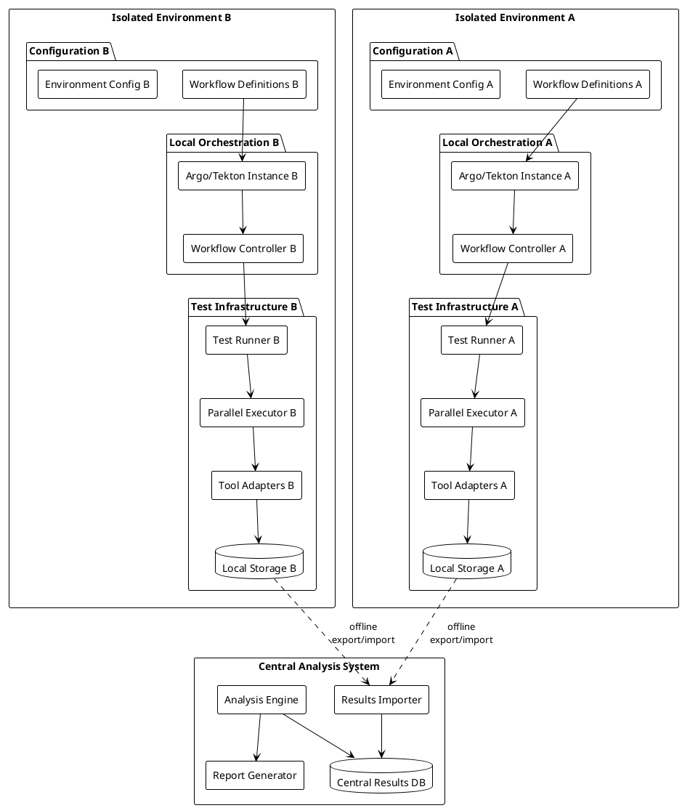
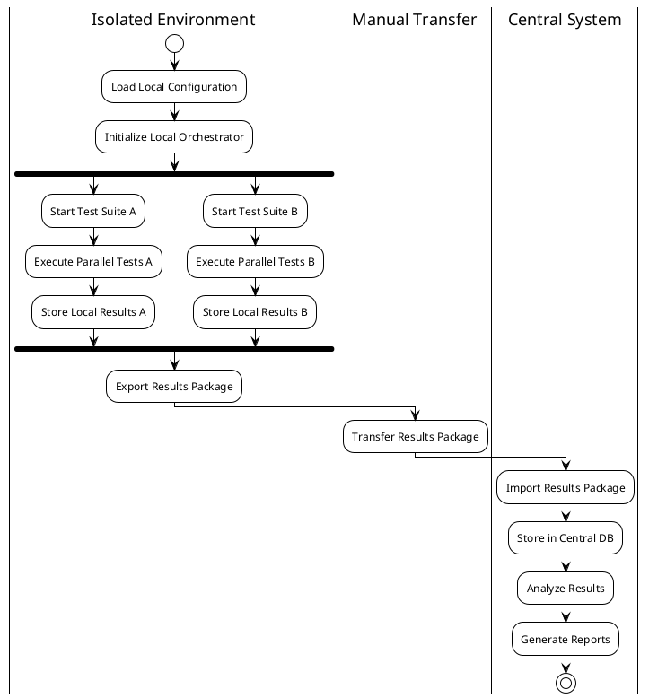
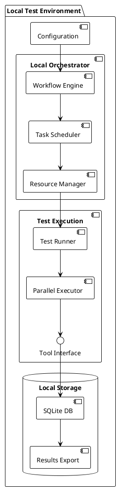
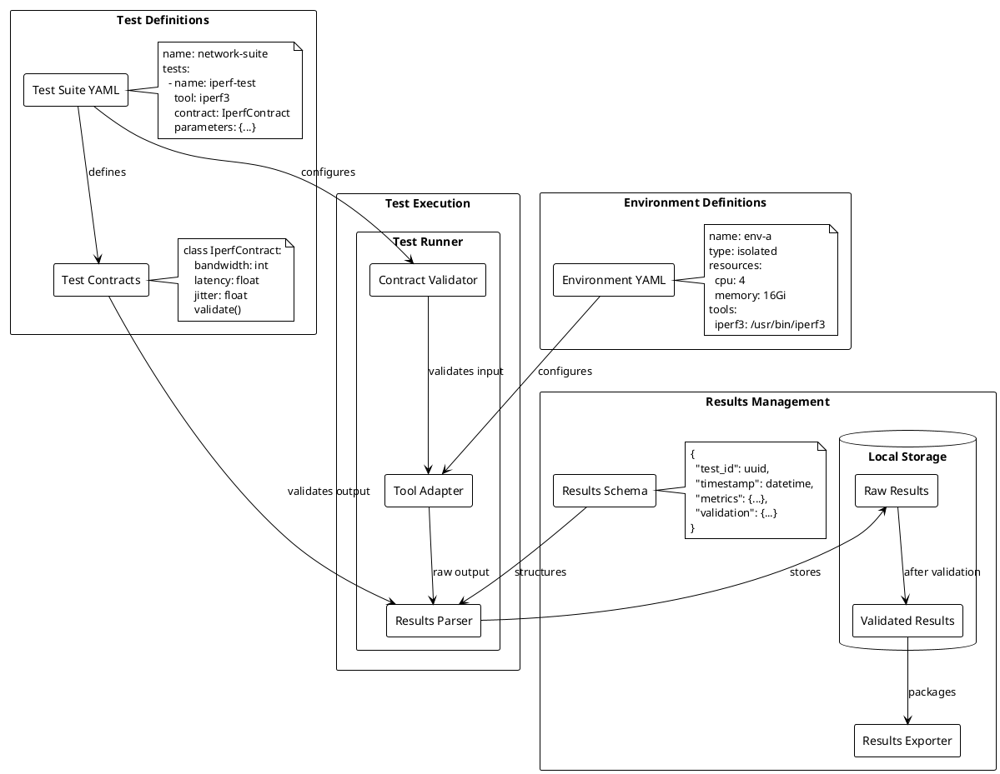
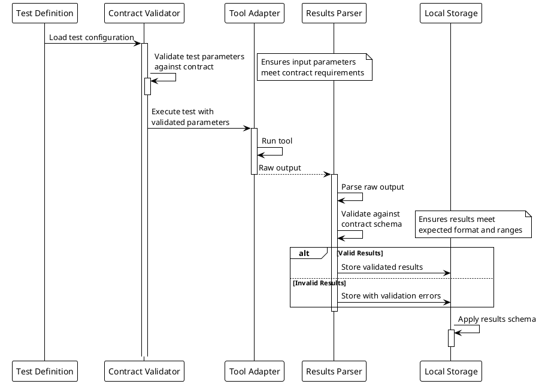
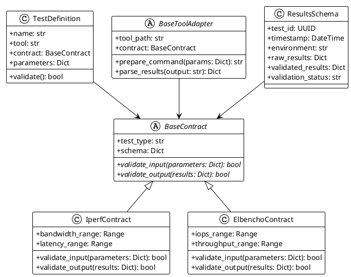

Ah, you're absolutely right! Let's redesign the architecture for truly isolated environments where each environment has its own orchestration capability. Here's the corrected design:







This design better reflects:
1. **Complete Isolation**: Each environment is self-contained with its own:
   - Orchestration (Argo/Tekton)
   - Storage
   - Test infrastructure
   - Configuration

2. **Offline Operation**:
   - No direct connection between environments
   - Results exported as packages
   - Manual transfer of results
   - Central system only for analysis

3. **Local Control**:
   - Each environment manages its own tests
   - Local resource management
   - Local parallelization
   - Local result storage

Here's how the workflow would typically work:

```python
# src/local/environment.py
class IsolatedEnvironment:
    def __init__(self, config_path: Path):
        self.config = self._load_config(config_path)
        self.orchestrator = self._initialize_orchestrator()
        self.storage = LocalResultsStorage(self.config['storage_path'])
        self.executor = ParallelTestExecutor(
            storage=self.storage,
            max_parallel=self.config.get('max_parallel', 4)
        )

    def run_workflow(self, workflow_path: Path):
        """Run a complete workflow in the isolated environment"""
        workflow = self._load_workflow(workflow_path)

        # Submit to local orchestrator
        workflow_id = self.orchestrator.submit_workflow(workflow)

        # Monitor progress
        status = self.orchestrator.monitor_workflow(workflow_id)

        # Export results when complete
        if status.is_completed():
            return self.export_results(workflow_id)

    def export_results(self, workflow_id: str) -> Path:
        """Export results as a portable package"""
        return self.storage.export_results(workflow_id)

# src/orchestration/local_orchestrator.py
class LocalOrchestrator:
    def __init__(self, config: Dict[str, Any]):
        self.workflow_engine = self._initialize_engine(config)
        self.scheduler = TaskScheduler(config.get('max_parallel', 4))
        self.resource_manager = ResourceManager(config.get('resources', {}))

    def submit_workflow(self, workflow: Dict[str, Any]) -> str:
        """Submit workflow to local orchestration engine"""
        workflow_id = str(uuid.uuid4())

        # Create execution plan
        execution_plan = self._create_execution_plan(workflow)

        # Submit to workflow engine
        self.workflow_engine.submit(workflow_id, execution_plan)

        return workflow_id

    def monitor_workflow(self, workflow_id: str) -> WorkflowStatus:
        """Monitor local workflow execution"""
        return self.workflow_engine.get_status(workflow_id)

# Usage example
async def main():
    # Initialize isolated environment
    env = IsolatedEnvironment(Path("./config"))

    # Run workflow
    workflow_path = Path("./workflows/benchmark_suite.yaml")
    results_package = env.run_workflow(workflow_path)

    print(f"Results exported to: {results_package}")
    print("Please transfer the results package to the central analysis system")
```

Key benefits of this design:
1. **Security**: Truly isolated environments
2. **Independence**: Each environment can operate independently
3. **Flexibility**: Can use different orchestration tools in different environments
4. **Scalability**: Each environment handles its own scaling
5. **Reliability**: No dependencies on external connectivity

The central system only needs to handle:
1. Importing result packages
2. Storing results in the central database
3. Analyzing results
4. Generating reports

This design better matches the requirement for completely isolated environments while still maintaining the ability to run parallel tests and collect results for central analysis.


Here's a focused diagram showing the relationship between test definitions, environments, data contracts, and results:



And here's a sequence diagram showing the data contract validation flow:



And a class diagram showing the contract relationships:



These diagrams show:

1. **Test Definition Structure**:
   - How tests are defined in YAML
   - Relationship with contracts
   - Environment configuration

2. **Data Contract Flow**:
   - Input validation
   - Test execution
   - Output validation
   - Results storage

3. **Contract Relationships**:
   - Contract hierarchy
   - How contracts relate to tools
   - Results schema

Example of the actual YAML definitions:

```yaml
# test_definitions.yaml
test_suites:
  network_performance:
    name: "Network Performance Suite"
    tests:
      - name: iperf_bandwidth
        tool: iperf3
        contract: IperfContract
        parameters:
          duration: 30
          parallel_streams: 4
          bandwidth: "1G"
        validation:
          min_bandwidth: "900M"
          max_latency: "10ms"

# contracts.yaml
contracts:
  IperfContract:
    parameters:
      duration:
        type: integer
        range: [1, 3600]
      parallel_streams:
        type: integer
        range: [1, 32]
      bandwidth:
        type: string
        pattern: "^\\d+[MGT]$"
    results:
      bandwidth:
        type: float
        unit: "bits/sec"
      latency:
        type: float
        unit: "ms"
      jitter:
        type: float
        unit: "ms"

# environments.yaml
environments:
  prod_environment:
    name: "Production Environment"
    type: isolated
    resources:
      cpu: 4
      memory: "16Gi"
    tools:
      iperf3: "/usr/local/bin/iperf3"
      elbencho: "/usr/local/bin/elbencho"
    storage:
      path: "/data/benchmark/results"
      format: "sqlite"
```

This structure provides:
- Clear test definitions
- Strong data validation
- Flexible environment configuration
- Structured results storage
- Clear validation flow
- Extensible contract system

The system can easily be extended with new test types by adding new contracts and tool adapters while maintaining consistent validation and results handling.
