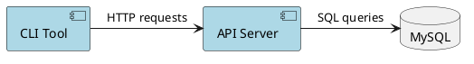

# Contributing to Documentation

This guide explains how to maintain and contribute to the Benchmark Analyzer Framework documentation.

## Documentation Overview

Our documentation is organized to serve different audiences and use cases:

- **Architecture docs** - High-level system design and interactions
- **Developer guides** - Step-by-step implementation instructions  
- **API documentation** - Auto-generated from code
- **Visual diagrams** - System relationships and flows

## Documentation Structure

```
docs/
├── README.md                           # Documentation index and navigation
├── CLI_API_ARCHITECTURE.md            # System architecture overview
├── WORKFLOW.md                         # Data flow and processing workflow
├── database_design.md                  # Database schema documentation
├── CONTRIBUTING.md                     # This file
├── guides/                             # Step-by-step implementation guides
│   ├── README.md                       # Guide index and navigation
│   ├── ADDING_NEW_TEST_TYPE.md        # Complete test type implementation
│   └── NETWORK_PERF_IMPLEMENTATION.md # Real-world case study
├── diagrams/                           # Visual documentation
│   ├── *.puml                         # PlantUML source files
│   └── *.png                          # Generated diagram images
└── prompts/                            # AI assistance and templates
```

## Documentation Types

### Architecture Documentation
**Location:** `/docs/` root  
**Purpose:** High-level system understanding  
**Audience:** Developers, architects, DevOps  
**Examples:** CLI_API_ARCHITECTURE.md, WORKFLOW.md

**Standards:**
- Include system diagrams
- Explain design decisions
- Cover both current and alternative approaches
- Provide troubleshooting sections

### Implementation Guides
**Location:** `/docs/guides/`  
**Purpose:** Step-by-step instructions  
**Audience:** Developers implementing features  
**Examples:** ADDING_NEW_TEST_TYPE.md

**Standards:**
- Complete code examples
- Step-by-step instructions
- Testing procedures
- Common pitfalls and solutions
- Prerequisites clearly stated

### Visual Documentation
**Location:** `/docs/diagrams/`  
**Purpose:** System visualization  
**Audience:** All technical stakeholders  
**Examples:** Component diagrams, ERDs, sequence diagrams

**Standards:**
- Use PlantUML when possible
- Include both source (.puml) and rendered (.png)
- Keep diagrams simple and focused
- Update when system changes

## Writing Guidelines

### General Principles
1. **Clarity over cleverness** - Write for understanding, not to impress
2. **Complete examples** - Provide working, copy-paste ready code
3. **Context matters** - Explain why, not just how
4. **Maintain consistency** - Follow established patterns and terminology
5. **Test everything** - Verify all instructions work before publishing

### Document Structure
```markdown
# Document Title

## Overview
Brief description of what this document covers and who should read it

## Prerequisites (if applicable)
- List of requirements
- Links to prerequisite reading

## Main Content
Organized into logical sections with clear headings

## Examples
Working code examples with expected outputs

## Troubleshooting (if applicable)
Common issues and their solutions

## Next Steps (if applicable)
What to do after reading this document

## Related Documentation
Links to related docs
```

### Markdown Standards
- Use descriptive headings with emoji prefixes for main sections
- Include table of contents for long documents
- Use code blocks with language specification
- Link to related documentation
- Include file paths in code examples
- Use tables for structured information

### Code Examples
```python
# Always include:
# 1. Necessary imports
# 2. Context/setup
# 3. The actual code
# 4. Expected output or next steps

from benchmark_analyzer.core.parser import ParserRegistry

# Register your new parser
parser = YourTestTypeParser()
ParserRegistry.register_parser("your_test_type", parser)
```

## Maintenance Workflow

### When Adding New Features
1. **Update affected documentation immediately**
2. **Add implementation guide if significant**
3. **Update architecture docs if design changes**
4. **Regenerate diagrams if structure changes**
5. **Update main README if user-facing**

### Regular Maintenance
- **Monthly:** Review documentation for accuracy
- **Per release:** Update version-specific information
- **When needed:** Reorganize if structure becomes unclear

### Documentation Review Process
1. **Technical accuracy** - Does the code actually work?
2. **Completeness** - Are all steps included?
3. **Clarity** - Can a new developer follow this?
4. **Links** - Do all internal links work?
5. **Currency** - Is information up to date?

## Contributing New Documentation

### Before You Start
1. Check if documentation already exists
2. Determine the appropriate location
3. Review similar documents for style consistency
4. Identify your target audience

### Creating New Documents

#### Architecture Documentation
```markdown
# System Component Name

## Overview
High-level description and purpose

## Architecture
How it fits into the larger system

## Implementation Details
Technical specifics and decisions

## API/Interfaces
How other components interact with it

## Configuration
Required setup and options

## Monitoring/Troubleshooting
How to diagnose issues

## Related Components
Links to related documentation
```

#### Implementation Guides
```markdown
# How to [Accomplish Task]

## Overview
What you'll build and why

## Prerequisites
- Required knowledge
- Required setup
- Links to background reading

## Step 1: [First Step]
Detailed instructions with code

## Step 2: [Second Step]
Continue with clear progression

## Testing Your Implementation
How to verify it works

## Troubleshooting
Common issues and solutions

## Next Steps
What to do next

## Related Guides
Links to related documentation
```

### Documentation Checklist
- [ ] Title clearly describes content
- [ ] Target audience is clear
- [ ] Prerequisites are listed
- [ ] All code examples are tested
- [ ] Internal links work
- [ ] Related documents are linked
- [ ] Added to appropriate index files
- [ ] Follows established style guide

## Linking and References

### Internal Links
```markdown
# Reference other docs
[Adding New Test Types](guides/ADDING_NEW_TEST_TYPE.md)

# Reference specific sections
[Database Schema](database_design.md#schema-overview)

# Reference main README
[Quick Start](../README.md#quick-start)
```

### External Links
```markdown
# External documentation
[FastAPI Documentation](https://fastapi.tiangolo.com/)

# API documentation (when running)
[API Docs](http://localhost:8000/docs)
```

### Code References
```markdown
# File references
`benchmark_analyzer/core/parser.py`

# Function/class references
`ParserRegistry.register_parser()`

# Configuration references
`DATABASE_URL` environment variable
```

## Publishing and Updates

### File Naming Conventions
- **Architecture docs:** `COMPONENT_NAME.md`
- **Guides:** `DOING_SOMETHING.md` (action-oriented)
- **Index files:** `README.md`
- Use SCREAMING_SNAKE_CASE for guide files
- Use lowercase for architecture files

### Update Process
1. **Create/edit documentation**
2. **Test all code examples**
3. **Update relevant index files**
4. **Update main README if needed**
5. **Check all links work**
6. **Commit with descriptive message**

### Versioning
- Documentation follows code versioning
- Major system changes require doc updates
- Breaking changes must update migration guides
- Deprecated features should be marked clearly

## Visual Documentation

### PlantUML Guidelines


### Diagram Standards
- Keep diagrams simple and focused
- Use consistent colors and styles
- Include legends when needed
- Store both source (.puml) and rendered (.png)
- Update diagrams when architecture changes

## Quality Assurance

### Before Publishing
- [ ] All links work (use link checker if available)
- [ ] Code examples execute successfully
- [ ] Spelling and grammar are correct
- [ ] Document follows style guide
- [ ] Target audience can understand content
- [ ] Related documents are updated

### Regular Reviews
- Check for outdated information
- Verify code examples still work
- Update screenshots if UI changed
- Consolidate redundant information
- Improve unclear sections based on feedback

## Getting Help

### Questions About Documentation
- Check existing documentation first
- Ask in team discussions
- Review similar implementations
- Consult architecture documentation

### Technical Writing Resources
- Follow established patterns in existing docs
- Keep sentences concise and clear
- Use active voice when possible
- Define technical terms when first used
- Include practical examples

## Measuring Success

Good documentation should:
- **Reduce support questions** about implementation
- **Enable self-service** for common tasks
- **Speed up onboarding** for new team members
- **Prevent implementation errors** through clear guidance
- **Facilitate maintenance** by documenting decisions

---

*This contributing guide is part of the living documentation. Please keep it updated as our processes evolve.*