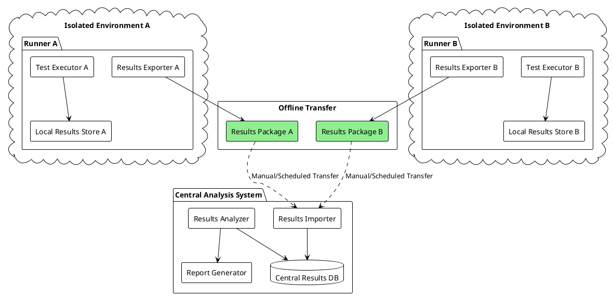
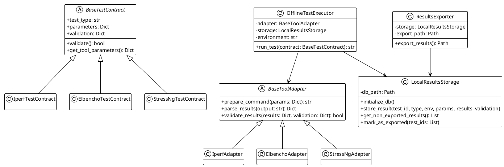
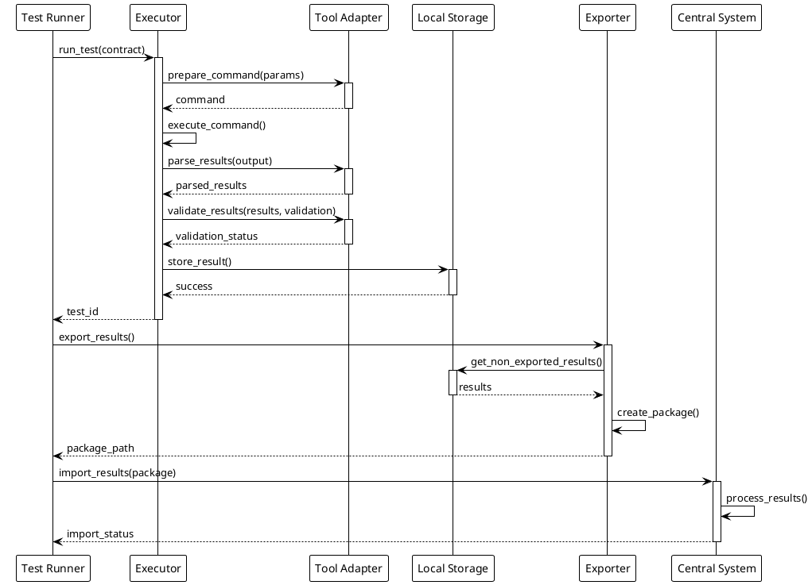

1. First, let's look at the complete directory structure:
```plaintext
benchmark-framework/
├── config/
│   ├── environments/
│   │   └── environments.yaml
│   └── tests/
│       └── test_definitions.yaml
├── src/
│   ├── contracts/
│   │   ├── __init__.py
│   │   ├── base_contract.py
│   │   └── validators.py
│   ├── adapters/
│   │   ├── __init__.py
│   │   ├── base_adapter.py
│   │   ├── iperf_adapter.py
│   │   ├── elbencho_adapter.py
│   │   └── stress_ng_adapter.py
│   ├── executor/
│   │   ├── __init__.py
│   │   └── offline_executor.py
│   ├── storage/
│   │   ├── __init__.py
│   │   └── local_storage.py
│   ├── exporter/
│   │   ├── __init__.py
│   │   └── results_exporter.py
│   ├── importer/
│   │   ├── __init__.py
│   │   └── results_importer.py
│   ├── analyzer/
│   │   ├── __init__.py
│   │   └── results_analyzer.py
│   └── cli/
│       ├── __init__.py
│       ├── export_cli.py
│       └── import_cli.py
├── tests/
└── requirements.txt
```

2. Configuration YAML files:

```yaml
# config/environments/environments.yaml
environments:
  prod_cluster_a:
    type: kubernetes
    description: "Production Cluster A"
    network:
      type: isolated
      subnet: "10.0.0.0/16"
    resources:
      cpu: 4
      memory: "16Gi"
    tools:
      iperf3: "/usr/local/bin/iperf3"
      elbencho: "/usr/local/bin/elbencho"
      stress-ng: "/usr/local/bin/stress-ng"
    export_path: "/data/benchmark/exports"
    local_storage: "/data/benchmark/results"

  dev_environment:
    type: local
    description: "Development Environment"
    network:
      type: connected
      subnet: "192.168.1.0/24"
    resources:
      cpu: 2
      memory: "8Gi"
    tools:
      iperf3: "/usr/bin/iperf3"
      elbencho: "/usr/bin/elbencho"
      stress-ng: "/usr/bin/stress-ng"
    export_path: "./exports"
    local_storage: "./results"

# config/tests/test_definitions.yaml
test_types:
  network_performance:
    tool: iperf3
    contract: IperfTestContract
    parameters:
      duration: 30
      bandwidth: "1G"
      parallel_streams: 4
      protocol: "tcp"
    validation:
      min_bandwidth: "100M"
      max_latency: "50ms"

  storage_performance:
    tool: elbencho
    contract: ElbenchoTestContract
    parameters:
      file_size: "1G"
      block_size: "1M"
      threads: 4
      direct_io: true
    validation:
      min_throughput: "100M"
      max_latency: "100ms"

  system_stress:
    tool: stress-ng
    contract: StressNgTestContract
    parameters:
      cpu_load: 80
      memory_load: "4G"
      duration: 300
    validation:
      max_cpu_temp: 85
      max_memory_usage: "90%"
```

3. Core Components Code:

```python
# src/contracts/base_contract.py
from abc import ABC, abstractmethod
from dataclasses import dataclass
from typing import Dict, Any

@dataclass
class BaseTestContract(ABC):
    test_type: str
    parameters: Dict[str, Any]
    validation: Dict[str, Any]

    @abstractmethod
    def validate(self) -> bool:
        pass

    @abstractmethod
    def get_tool_parameters(self) -> Dict[str, Any]:
        pass

# src/contracts/validators.py
from pydantic import BaseModel
from typing import Optional

class IperfTestContract(BaseTestContract):
    class Parameters(BaseModel):
        duration: int
        bandwidth: str
        parallel_streams: int
        protocol: str

    class Validation(BaseModel):
        min_bandwidth: str
        max_latency: str

    def validate(self) -> bool:
        try:
            self.Parameters(**self.parameters)
            self.Validation(**self.validation)
            return True
        except Exception as e:
            print(f"Validation error: {e}")
            return False

# src/adapters/base_adapter.py
from abc import ABC, abstractmethod
from typing import Dict, Any

class BaseToolAdapter(ABC):
    @abstractmethod
    def prepare_command(self, params: Dict[str, Any]) -> str:
        pass

    @abstractmethod
    def parse_results(self, output: str) -> Dict[str, Any]:
        pass

    @abstractmethod
    def validate_results(self, results: Dict[str, Any], validation: Dict[str, Any]) -> bool:
        pass

# src/storage/local_storage.py
import sqlite3
import json
from pathlib import Path
from datetime import datetime
from typing import Dict, Any, List

class LocalResultsStorage:
    def __init__(self, db_path: Path):
        self.db_path = db_path
        self.initialize_db()

    def initialize_db(self):
        self.db_path.parent.mkdir(parents=True, exist_ok=True)
        with sqlite3.connect(self.db_path) as conn:
            conn.execute("""
                CREATE TABLE IF NOT EXISTS test_results (
                    id TEXT PRIMARY KEY,
                    test_type TEXT,
                    environment TEXT,
                    timestamp TEXT,
                    parameters JSON,
                    results JSON,
                    validation JSON,
                    exported INTEGER DEFAULT 0
                )
            """)

    def store_result(self, test_id: str, test_type: str,
                    environment: str, parameters: Dict,
                    results: Dict, validation: Dict):
        with sqlite3.connect(self.db_path) as conn:
            conn.execute(
                """
                INSERT INTO test_results
                (id, test_type, environment, timestamp, parameters, results, validation)
                VALUES (?, ?, ?, ?, ?, ?, ?)
                """,
                (
                    test_id,
                    test_type,
                    environment,
                    datetime.utcnow().isoformat(),
                    json.dumps(parameters),
                    json.dumps(results),
                    json.dumps(validation)
                )
            )

# src/executor/offline_executor.py
import asyncio
import uuid
import os
from typing import Dict, Any
from ..contracts.base_contract import BaseTestContract
from ..adapters.base_adapter import BaseToolAdapter
from ..storage.local_storage import LocalResultsStorage

class OfflineTestExecutor:
    def __init__(self,
                 adapter: BaseToolAdapter,
                 storage: LocalResultsStorage,
                 environment: str):
        self.adapter = adapter
        self.storage = storage
        self.environment = environment

    async def run_test(self, contract: BaseTestContract) -> str:
        test_id = str(uuid.uuid4())

        # Validate contract
        if not contract.validate():
            raise ValueError("Invalid test contract")

        # Prepare and execute command
        cmd = self.adapter.prepare_command(contract.parameters)
        proc = await asyncio.create_subprocess_shell(
            cmd,
            stdout=asyncio.subprocess.PIPE,
            stderr=asyncio.subprocess.PIPE
        )

        stdout, stderr = await proc.communicate()

        # Parse and validate results
        results = self.adapter.parse_results(stdout.decode())
        if not self.adapter.validate_results(results, contract.validation):
            results['validation_status'] = 'failed'
        else:
            results['validation_status'] = 'passed'

        # Store results
        self.storage.store_result(
            test_id=test_id,
            test_type=contract.test_type,
            environment=self.environment,
            parameters=contract.parameters,
            results=results,
            validation=contract.validation
        )

        return test_id
```

4. PlantUML Diagrams:







5. Usage Example:

```python
async def main():
    # Load configurations
    with open('config/environments/environments.yaml') as f:
        env_config = yaml.safe_load(f)

    with open('config/tests/test_definitions.yaml') as f:
        test_config = yaml.safe_load(f)

    # Initialize components
    environment = "prod_cluster_a"
    env_settings = env_config['environments'][environment]

    storage = LocalResultsStorage(
        Path(env_settings['local_storage']) / 'results.db'
    )

    # Create adapters and executors
    adapters = {
        'iperf3': IperfAdapter(env_settings['tools']['iperf3']),
        'elbencho': ElbenchoAdapter(env_settings['tools']['elbencho']),
        'stress-ng': StressNgAdapter(env_settings['tools']['stress-ng'])
    }

    executor = OfflineTestExecutor(
        adapter=adapters['iperf3'],
        storage=storage,
        environment=environment
    )

    # Run tests
    for test_type, test_def in test_config['test_types'].items():
        contract = create_contract(test_type, test_def)
        test_id = await executor.run_test(contract)
        print(f"Completed test {test_id}")

    # Export results
    exporter = ResultsExporter(
        storage=storage,
        export_path=Path(env_settings['export_path'])
    )

    package_path = exporter.export_results()
    print(f"Results exported to {package_path}")

if __name__ == "__main__":
    asyncio.run(main())
```

This implementation provides:
- Clear configuration through YAML files
- Isolated execution environments
- Local storage of results
- Offline export/import capability
- Extensible adapter system
- Validation at multiple levels
- Clear separation of concerns

The system can be extended by:
- Adding new test types
- Creating new tool adapters
- Implementing different storage backends
- Adding more sophisticated analysis capabilities
- Implementing additional validation rules
